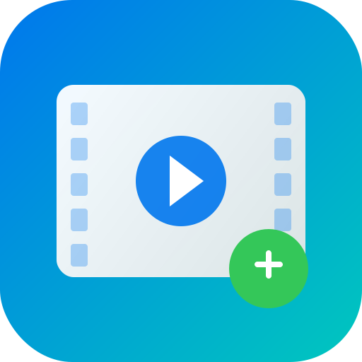

# 视频片头添加器

<p align="center">
  
</p>

<p align="center">
  <strong>批量为视频添加片头，快速高效，专为字幕组设计</strong>
</p>

<p align="center">
  <a href="#功能特点">功能特点</a> •
  <a href="#下载安装">下载安装</a> •
  <a href="#使用方法">使用方法</a> •
  <a href="#常见问题">常见问题</a> •
  <a href="#开发指南">开发指南</a>
</p>

---

## 功能特点

- **批量处理** - 一次性为多个视频添加片头，支持递归处理子文件夹
- **智能适配** - 自动将片头转码为与主视频一致的分辨率、帧率、编码格式
- **无损拼接** - 主视频不重新编码，保持原画质，处理速度快
- **多格式支持** - 支持 MP4、MKV、MOV、AVI、WMV、FLV、WebM、M4V、TS 等常见格式
- **灵活输出** - 可选择输出到新文件夹或直接覆盖源文件
- **实时进度** - 显示处理进度和详细日志
- **跨平台** - 支持 Windows 和 macOS
- **开箱即用** - 内置 FFmpeg，无需额外安装

## 下载安装

前往 [Releases](../../releases) 页面下载最新版本：

| 平台 | 下载 |
|------|------|
| Windows | `视频片头添加器-Setup-x.x.x.exe` |
| macOS | `视频片头添加器-x.x.x.dmg` |

### Windows 安装

1. 下载 `.exe` 安装包
2. 双击运行，按提示完成安装
3. 从开始菜单或桌面快捷方式启动

### macOS 安装

1. 下载 `.dmg` 文件
2. 双击打开，将应用拖入 Applications 文件夹
3. 首次运行时，右键点击应用选择「打开」

## 使用方法

### 基本步骤

1. **选择片头视频** - 点击「浏览」选择你的片头文件
2. **选择视频目录** - 选择包含待处理视频的文件夹（会自动搜索子文件夹）
3. **选择输出目录**（可选）- 默认在视频目录下创建 `output` 文件夹
4. **开始处理** - 点击「开始处理」按钮

### 输出模式

#### 默认模式（推荐）
- 在视频目录下创建 `output` 文件夹
- 保持原有目录结构
- 文件名与原视频一致
- 原视频不受影响

```
视频目录/
├── 第一集.mp4
├── 第二集.mp4
└── output/           ← 自动创建
    ├── 第一集.mp4    ← 已加片头
    └── 第二集.mp4
```

#### 覆盖模式
- 勾选「覆盖源文件」选项
- 直接替换原视频
- 请确保有备份！

### 支持的视频格式

| 格式 | 扩展名 |
|------|--------|
| MPEG-4 | `.mp4`, `.m4v` |
| Matroska | `.mkv` |
| QuickTime | `.mov` |
| AVI | `.avi` |
| Windows Media | `.wmv` |
| Flash Video | `.flv` |
| WebM | `.webm` |
| MPEG-TS | `.ts` |

## 工作原理

本工具采用**智能拼接**技术，处理流程如下：

1. **分析主视频** - 获取分辨率、帧率、编码格式等参数
2. **转码片头** - 将片头转换为与主视频一致的参数
3. **无损拼接** - 使用 FFmpeg concat demuxer 进行无损拼接

由于主视频不需要重新编码，处理速度非常快：
- 10分钟视频 ≈ 片头转码时间（几秒到十几秒）
- 1小时视频 ≈ 片头转码时间 + 少量 IO 时间

## 常见问题

### Q: 处理速度如何？
A: 由于主视频不重新编码，处理速度主要取决于片头长度。一个 10 秒的片头，无论主视频是 10 分钟还是 1 小时，处理时间基本相同。

### Q: 支持哪些编码格式？
A: 支持 H.264、H.265/HEVC、VP8、VP9、AV1 等主流视频编码，以及 AAC、MP3、Opus、Vorbis、AC3、FLAC 等音频编码。

### Q: 片头和主视频分辨率不同怎么办？
A: 工具会自动将片头缩放到与主视频相同的分辨率，并在必要时添加黑边保持比例。

### Q: 为什么输出文件比原文件大？
A: 输出文件 = 原文件 + 片头大小。如果文件明显变大，可能是因为片头编码参数与主视频差异较大，导致转码后的片头体积较大。

### Q: macOS 提示「无法打开，因为它来自身份不明的开发者」？
A: 右键点击应用，选择「打开」，然后在弹出的对话框中再次点击「打开」。

## 开发指南

### 环境要求

- Node.js 18+
- npm 或 yarn

### 本地开发

```bash
# 克隆仓库
git clone https://github.com/yourusername/video-intro-adder.git
cd video-intro-adder

# 安装依赖
npm install

# 启动开发模式
npm start
```

### 打包构建

```bash
# Windows
npm run build:win

# macOS
npm run build:mac

# 全平台
npm run build:all
```

打包后的文件在 `dist/` 目录下。

### 项目结构

```
video-intro-adder/
├── src/
│   ├── main.js           # Electron 主进程
│   ├── preload.js        # 预加载脚本
│   ├── index.html        # UI 界面
│   ├── styles.css        # 样式文件
│   ├── renderer.js       # 渲染进程逻辑
│   └── ffmpeg-handler.js # FFmpeg 处理模块
├── assets/               # 资源文件
├── package.json          # 项目配置
└── README.md
```

## 技术栈

- [Electron](https://www.electronjs.org/) - 跨平台桌面应用框架
- [fluent-ffmpeg](https://github.com/fluent-ffmpeg/node-fluent-ffmpeg) - FFmpeg Node.js 封装
- [@ffmpeg-installer/ffmpeg](https://github.com/kribblo/node-ffmpeg-installer) - 跨平台 FFmpeg 二进制

## 许可证

[MIT License](LICENSE)

## 致谢

感谢所有字幕组的辛勤付出！

---

<p align="center">
  如果这个工具对你有帮助，欢迎 ⭐ Star 支持！
</p>
